<div align="center">



<br/><br/>

<a href="https://linkedin.com/in/priyanshu-pandita"></a>
<a href="mailto:priyanshupandita@gmail.com"></a>
<a href="https://github.com/Priyanshupandita07"></a>
<a href="https://priyanshu-pandita.vercel.app"></a>

<br/><br/>



<br/><br/>



<br/><br/>

</div>

<details>
<summary><strong>&nbsp;⬡ &nbsp;Chicago Crime Analytics Pipeline</strong> — full breakdown</summary>

<br/>

| Attribute | Detail |
|---|---|
| **Stack** | Python · PySpark · BigQuery · Dataproc · Cloud Scheduler · Cloud Storage |
| **Scale** | 500,000 rows · Chicago crime data 2020–2026 |
| **Data Quality** | Dropped 6,670 null-GPS rows · filled missing locations · derived month, hour, is-night, is-arrested columns |
| **Insights** | THEFT most common (95,679 cases, 6.01% arrest rate) · BATTERY highest arrest rate (15.99%) |
| **Automation** | Daily execution via Cloud Scheduler — fresh data in BigQuery every morning, zero manual intervention |

</details>

<details>
<summary><strong>&nbsp;⬡ &nbsp;Pharma Sales Analytics Pipeline</strong> — full breakdown</summary>

<br/>

| Attribute | Detail |
|---|---|
| **Stack** | Python · Pandas · BigQuery · Cloud Storage |
| **Scale** | 2,106 rows · 8 drug categories |
| **Data Quality** | Deduplication · NULL handling · validation for reliable downstream analytics |
| **Insights** | Saturday highest avg daily sales (65.67 units) · N02BE top-selling drug across all categories |

</details>

<details>
<summary><strong>&nbsp;⬡ &nbsp;BitePay — B2B SaaS Platform</strong> — full breakdown</summary>

<br/>

| Attribute | Detail |
|---|---|
| **Stack** | React · JavaScript · REST APIs · JWT · Multi-tenant Architecture |
| **Scale** | 20 restaurant clients · 12,500+ orders |
| **Role** | Software Developer Intern (Jan 2026 – Jun 2026) · owned 3 production modules end-to-end |
| **Auth** | JWT-based auth · protected routes with React Router · tenant-level UI isolation |

</details>

<br/>

<div align="center">
<h2>⬡ &nbsp; Experience</h2>
</div>

**Software Developer Intern** · **Bitepay** · *Remote* — `Jan 2026 – Jun 2026`
Owned order management, table management, and multi-restaurant auth modules on a live platform. Integrated REST APIs handling 12,500+ orders across a multi-tenant architecture serving 20 restaurants.

**Web Development Intern** · **ERC Jnana Prabodhini** · *Pune* — `Jul 2025 – Dec 2025`
Delivered the Nisargamitra Olympiad platform independently — onboarding 200+ students for registration, syllabus access, and interactive learning.

<br/>

<div align="center">
<h2>⬡ &nbsp; Achievements</h2>
</div>

<div align="center">

| Recognition | Details |
|:---:|:---:|
| 🥉 **3rd Place — HackMIT (MIT-WPU)** | AI chatbot tutor with voice + emotion detection · 30+ teams |
| 🇮🇳 **Smart India Hackathon 2023** | Top teams among 500+ college-level participants |
| 🎓 **Deloitte Australia — Forage** | Data analytics job simulation · certified June 2026 |

</div>

<br/>

<div align="center">
<h2>⬡ &nbsp; Contribution Snake</h2>
</div>

<div align="center">

<picture>
  <source media="(prefers-color-scheme: dark)" srcset="https://raw.githubusercontent.com/Priyanshupandita07/Priyanshupandita07/output/github-snake-dark.svg" />
  <source media="(prefers-color-scheme: light)" srcset="https://raw.githubusercontent.com/Priyanshupandita07/Priyanshupandita07/output/github-snake.svg" />
  
</picture>

</div>

<br/>

<div align="center">
<h2>⬡ &nbsp; Current Focus</h2>
</div>

```yaml
learning:   [Advanced SQL — LeetCode 36/75, dbt fundamentals, BigQuery optimisation]
building:   [Pipeline monitoring & alerting, dbt transformation layers]
exploring:  [Airflow orchestration, Pub/Sub streaming, star schema modelling]
open_to:    [Data Engineering · Analytics Engineering · full-time, June 2026]
```

<br/>

<div align="center">



</div>
